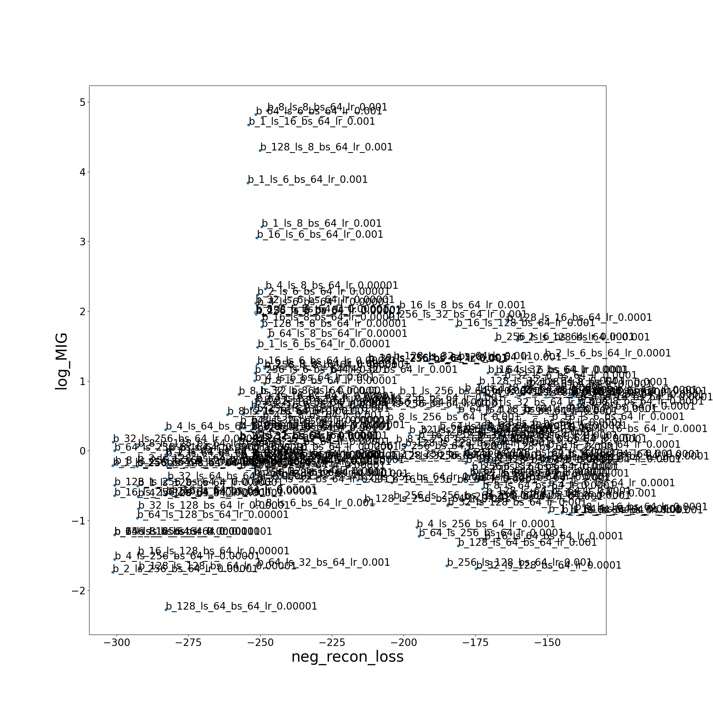
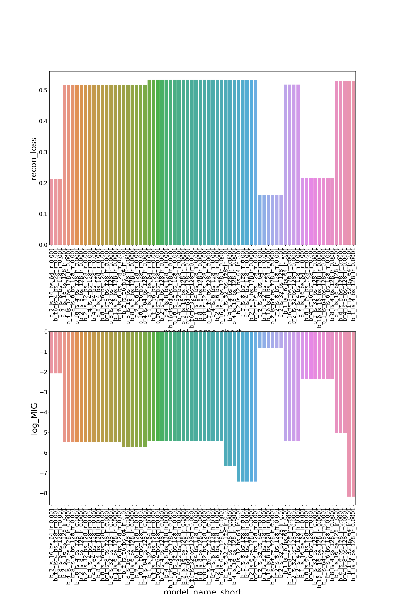
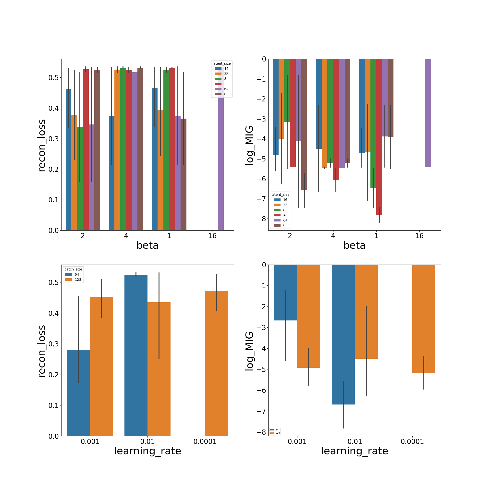
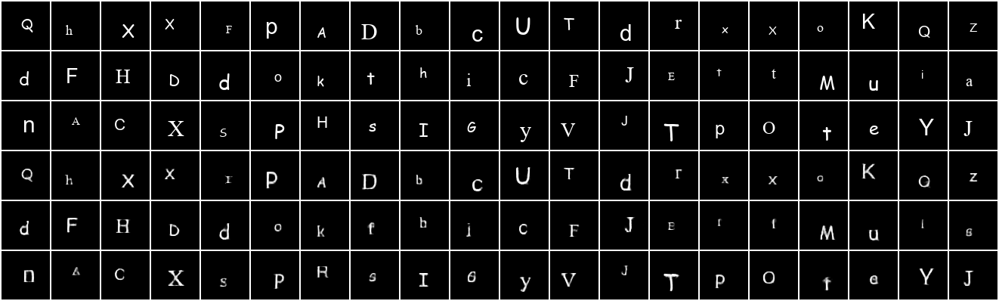
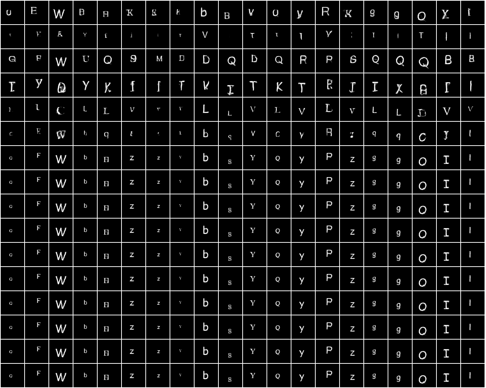
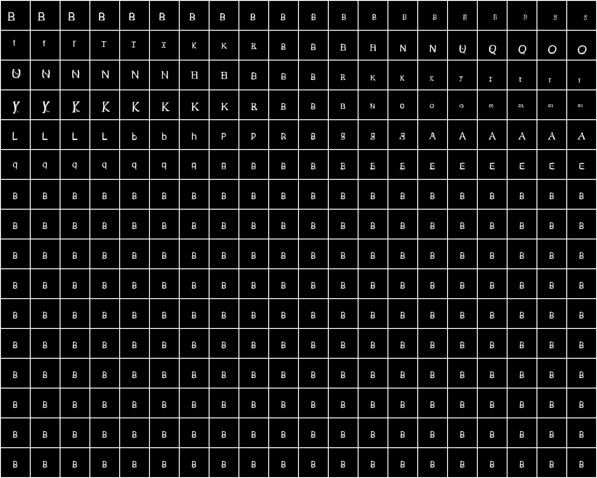

# Disentangling Orthography using beta-VAE:

Table of Contents:
1. [Grid Search](#Grid_Search)
2. [Best Model](#Best_model)

## Grid_Search
Optimization of model hyperparameters and training setup for both the reconcostruction loss (recon_loss) and disentanglment of the latent units (quantified by the mututal-information gap MIG), where model and training hyperparameters are:
b - beta size of the regularization in ELBO.
ls - latent size of the latent layer.
bs - batch size during training.
lr - learning rate.

*
    
    The smaller learning-rate is better for both reconstruction loss and MIG. Higher beta value improves MIG as expected.
*
    
*
    
 
## Best_Model
Latent-layer analysis of one of the models from the Pareto front (b_2_ls_32_bs_64_lr_0.001) in terms of both reconstruction loss and mutual information -
* Reconstruction: grid of reconstructions of samples. First block of row is for originals, second for reconstructions:
    
* Posterior traversals: grid of gifs where rows are latent dimensions, columns are examples, each gif shows posterior traversals:

    
* Prior traversals: grid of gifs where rows are latent dimensions:

    
